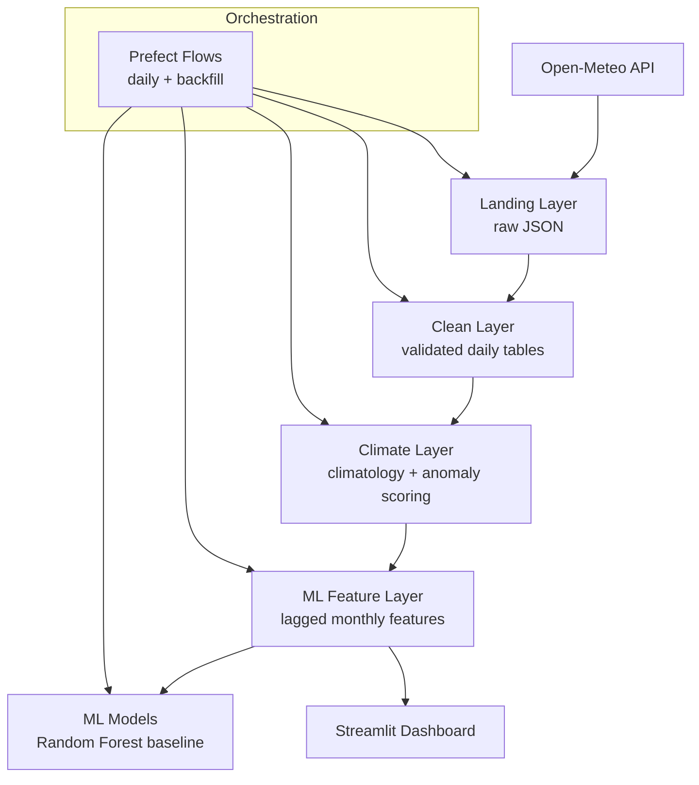

```markdown
# California–Portugal Climate Pipeline  
### A Full-Stack Climate Data Engineering, Analytics & Machine Learning System

This project implements an end-to-end climate data platform comparing four coastal Mediterranean-like cities:

- Los Angeles (US)  
- San Francisco (US)  
- Lisbon (PT)  
- Porto (PT)

Using daily historical weather data from **1980–present**, the system ingests, transforms, models, and analyzes long-term climate patterns and anomaly events. It produces:

- A production-ready DuckDB warehouse  
- A multi-layer dbt pipeline  
- An ML-ready feature store  
- A baseline RandomForest anomaly model  
- A Streamlit analytics dashboard  
- Prefect orchestration (daily + backfill workflows)  
- Automated data quality tests  
- Full observability logging (pipeline + ML metrics)

---


## Architecture Overview (Mermaid)



---

## Pipeline Layers (Descriptive Naming)

### 1. Raw Layer (formerly Bronze)
Contains **structured but unmodified** Open-Meteo daily weather and geocoding metadata.

---

### 2. Cleaned Layer (formerly Silver)
Validated, normalized, and feature-enriched daily + monthly weather data.

Adds:  
- extreme heat flags  
- tropical night flags  
- heavy precipitation detection  
- seasonal features  
- schema enforcement  

---

### 3. Analytics Layer (formerly Gold)
High-level, domain-focused climate analytics:

- climatology baselines  
- anomaly scoring  
- temporal lags  
- inter-city correlations  
- anomaly event labels  

---

### 4. ML Feature Store
Final feature matrix for supervised anomaly detection:

- engineered temperature deltas  
- multi-month lags  
- seasonal context  
- anomaly flags  
- target labels  

---

## Machine Learning Layer

Baseline anomaly model:

- RandomForestClassifier  
- Target: `is_positive_temp_anomaly`  
- Time-aware splitting  
- Metrics logged into DuckDB via observability module

Artifacts:

- `models/baseline_rf.pkl`  
- `models/baseline_rf_metrics.json`

Run training:

uv run climate-train-baseline

---

## Streamlit Dashboard

Location:

dashboards/streamlit/app.py

Run:

uv run streamlit run dashboards/streamlit/app.py

Provides:

- City comparisons  
- Monthly climatology trends  
- Anomaly visualization  
- ML model monitoring  
- Pipeline run history & freshness checks  

---

## Orchestration (Prefect)

Daily pipeline:

uv run python -m climate_pipeline.orchestration.prefect_flow daily

Backfill pipeline:

uv run python -m climate_pipeline.orchestration.prefect_flow backfill --start-date ... --end-date ...

Steps:

1. Fetch daily weather  
2. dbt build (all layers)  
3. Optional dbt tests  
4. Train ML model  
5. Optional pytest  
6. Observability logging  

---

## Testing

uv run pytest

Tests include:

- Data quality  
- Schema validation  
- ML correctness  
- Edge-case handling  

---

## Project Structure (Simplified)

california-portugal-climate/  
    README.md  
    pyproject.toml  
    data/  
        raw/  
        warehouse/climate.duckdb  
    dbt/  
    src/climate_pipeline/  
    dashboards/streamlit/  
    tests/  
    logs/  

---

## Quick Start

uv sync  
uv run climate-train-baseline  
uv run streamlit run dashboards/streamlit/app.py  

---

## Planned Enhancements

- Teleconnection indices (ENSO, NAO, PDO, AMO)  
- SST + reanalysis integrations  
- Transformer/LSTM anomaly forecasting  
- Short-term (3-day) temperature forecasting  
- Expanded observability dashboards  
- Docker deployment + cloud hosting  
```